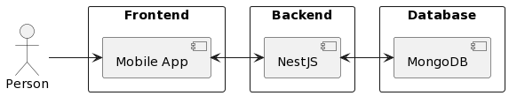
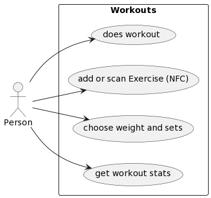

= NextFit Documentation
:toc:

== Github Repository

* <https://github.com/tmittermayr/ITP-Projekt_Fitness-App>

== Init

=== Setup

. git clone <https://github.com/tmittermayr/ITP-Projekt_Fitness-App.git>

. npm init

. npm install -g \@ionic/cli@latest

. npm install -g \@ionic/cli

. npm install -g \@nestjs/cli

=== Start Development Servers

. open repo folder in terminal

. cd development/nextfit

. ionic serve

. now open new terminal

. cd development/nextfit-server

. nest start
 

== Documents

=== Color Scheme

|===
|black| #141414
|dark-gray| #565656
|light-gray| #9E9E9E
|orange| #FBA92C
|white| #fffff     
|===
[style="font-size: 80%;"]

=== Wireframe

* <https://github.com/tmittermayr/ITP-Projekt_Fitness-App/blob/main/documents/nextfit_wireframe.xd>

=== Project Proposal

==== Projektauftraggeber

* Prof. Reder
* Prof. Rager
* Prof. Schraml
* Prof. Landvoigt

=== Problemstellung

Personen, die im Fitnessstudio angemeldet sind, haben oftmals das
Problem, die Informationen eines Trainings (Gewicht, Sätze,
Wiederholungen, etc.) zu speichern/verwalten. Das ist jedoch wichtig, da
man seinen Fortschritt und Erfolge mitverfolgen möchte bzw. oft
Informationen können wie z.B. das zuletzt verwendete Gewicht bei einer
bestimmten Maschine wissen möchte. Zudem kann jemandem auch die
Informationen zur Ausführung bzw. Anwendung eines Gerätes/ einer Übung
fehlen.

=== Lösung:

Die App soll diese Probleme gemeinsam lösen. Derzeit gibt es von
einzelnen Fitnessstudios QR-Codes, die die einzige Funktion haben, auf
eine Webseite mit dem jeweiligen Tutorial der Maschine zu verweisen. Zum
\"mittracken\" gibt es bereits diverse Apps, jedoch sind diese rein
darauf spezialisiert. Wir wollen nun diese beiden Funktionen verbinden
und mithilfe von NFC-Chips die Verwendung vereinfachen.

=== Generelle Richtlinien

* Wir arbeiten mit Scrum und dem Programm \"Notion\"
* Als Technologien zur Realisierung wird Flutter (Sprache: Dart) mit
    Firebase oder gegebenenfalls React Native mit NodeJS, falls wir auf
    Realisierungsprobleme bei Flutter stoßen, verwendet
* Github, Notion (TODOs zuordnen), für kleinere organisatiorische
    Sachen Whatsapp
* Fertigstellung wird bis zur Projektabgabe im nächsten Schuljahr
    stattfinden

=== Team:
** Timo Mittermayr
** Valentin Seeger
** Jan Angerer

=== Timo Mittermayr

* Erfahrung mit NFC Technologie
* Flutter Grundwissen
* Crossplatform Programmierung mit React Native
* NodeJS Backend Grundlagen
* Design
* SQL

=== Valentin Seeger

* Erfahrung mit NFC Technologie
* Flutter Grundwissen
* NodeJS Backend fortgeschrittene Kenntnisse
* SQL
* Design

=== Jan Angerer

* Flutter Grundwissen
* NodeJS Grundlagen
* SQL
* Design

=== Projektziel

* Trainingsprotokoll

** Informationen zu jeder ausgeführten Übung/Gerät können
    eingetragen werden (Gewicht, Sätze, Wiederholungen, etc.) und
    jederzeit wieder aufgerufen werden. Ebenfalls können
    Ausdauerübungen mitgestoppt werden.

* NFC-Kompatibel

** Dabei wird das Smartphone einer Person, an den NFC-Chip des
    jeweiligen Gerätes gehalten und es öffnet sich die App mit einem
    PopUp, welches zunächst Informationen zu dem Gerät enthält. Des
    weiteren kann man dieses Gerät zu seinem Training hinzufügen.

* Kalender

** Trainings sind dort sichtbar und können im Nachhinein abgerufen
    werden

* Fortschritt

** Der Fortschritt kann mithilfe von automatisch generierten
    Tabellen bzw. Grafiken angesehen werden: Verlauf des
    Trainingsgewichts über einen längeren Zeitraum,

** Gewichtsrekorde (sehr wichtig für viele Kraftsportler) wird im
    Startmenü angezeigt

* Apple Health/Google Fit Kompatibilität

** Die Schritte, verbrannten Kalorien und weitere Informationen
    können in der App angezeigt und verarbeitet werden. Diese können
    dann zum Beispiel in den Infografiken oder im Kalender
    miteingebunden werden.

* 3D Model von Muskelskelet, um so Übungen für Muskelgruppen zu suchen

* Infografiken von Gewichtsverlauf als Motivation für Gewichtsziele

+++

=== Projektressourcen

* gute Internetverbindung

* eigene Laptops

* NFC-Chips

* Timo: \~ 150 Stunden Arbeitszeit

* Valentin: \~ 150 Stunden Arbeitszeit

* Jan: \~ 150 Stunden Arbeitszeit

=== Möglichkeiten

* Fitnessfunktionen in einer App zusammenfassen

* Vereinfachung des Tracking eines Trainings

=== Risiken

* Installation und Einrichtung der NFC-Chips zu viel Aufwand

* Durch viele Features uninteressant für Benutzer, die nur einen
    Bruchteil davon brauchen -\> UX/UI so übersichtlich und so
    minimalistisch wie möglich gestalten.

* Teammitglied hört mit der Schule auf

=== Wettbewerb und Marketing

Das Projekt soll durch den Verkauf an Fitness Studios, welcher wie folgt
ablaufen soll, Einnahmen generieren:

-   Anforderung eines Fitnessstudios und Angabe der vorhandenen Geräte
    werden gespeichert

-   Wir beschreiben die NFC-Sticker

-   Verkauf an das Fitness Studio für geringe Kosten

Der Gewinn soll durch In-App-Advertising, bzw. verschiedene Abonnements,
die Funktionen in der App freischalten, erzielt werden.

Im Vergleich zu anderen Fitness Apps bieten wir eine
Anfängerfreundlichkeit und eine Erleichterung des Trainingsalltags (alle
benötigten Funktionen sind in einer App zusammengefasst).

=== Planung - Inhalt

|===
|Meilenstein |Definition |Abschluss
|M1 |Aufgaben der App genau definieren und UI/UX dazu bestimmen |15.11.2022                               
|M2 |Machbarkeitsstudie und Festellung der verwendeteten Technologien |20.12.2022                  
|M3 |Basic App mit Frontend erstellen |29.02.2023
|M4 |Grundfunktionen implementieren und NFC-Anbindung |11.04.2023                   
|M5 |Weiterentwickeln und Funktionen für nächstes Schuljahr bestimmen |04.07.2023                          
|M6 |Projekt fertigstellen und Testen (evt. auch  Projektende vermarkten)       
|===

=== Rollen

*Projektleiter:* Valentin Seeger

*Programmierer:* Valentin Seeger, Jan Angerer, Timo Mittermayr

=== Positive Stakeholder

[.stretch]
|===
|*Positive Stakeholder* |*Grund*    
|Fitness Anfänger |Profitieren von der Tutorial-Funktion                   
|Trainierende |Tracking der Fitnessfortschritte (Gewichte und Wiederholungen)       
|Fitnessstudios |Bietet den Kunden simple Bedienungsanleitungen               
|Fitnessgeräte-Hersteller |Bietet den Kunden simple Bedienungsanleitungen               
|NFC-Hersteller |Profitieren von den benötigten NFC-Chips                           
|Auftraggeber |Bekommen das aufgetragene Projekt   
|===

=== Negative Stakeholder

[.stretch]
|===
|*Negative Stakeholder* |*Grund*      
|Fitness-Trainer |Verkaufen weniger Trainingsstunden
|Andere Fitnessapps |Konkurrenten in der Fitness-App Branche
|Fitness-Anwälte |Fitnessstudios können verklagt werden bei Falschbedienung der Geräte
|Fitness-Influenzer |Videos werden weniger angeschaut
|Body-Positivity Vertreter |Vertreten ihre Meinung, dass Fitness nutzlos ist, da alle Körper schön sind
|===

== UML

== Use Case Diagramm

